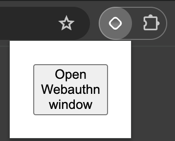
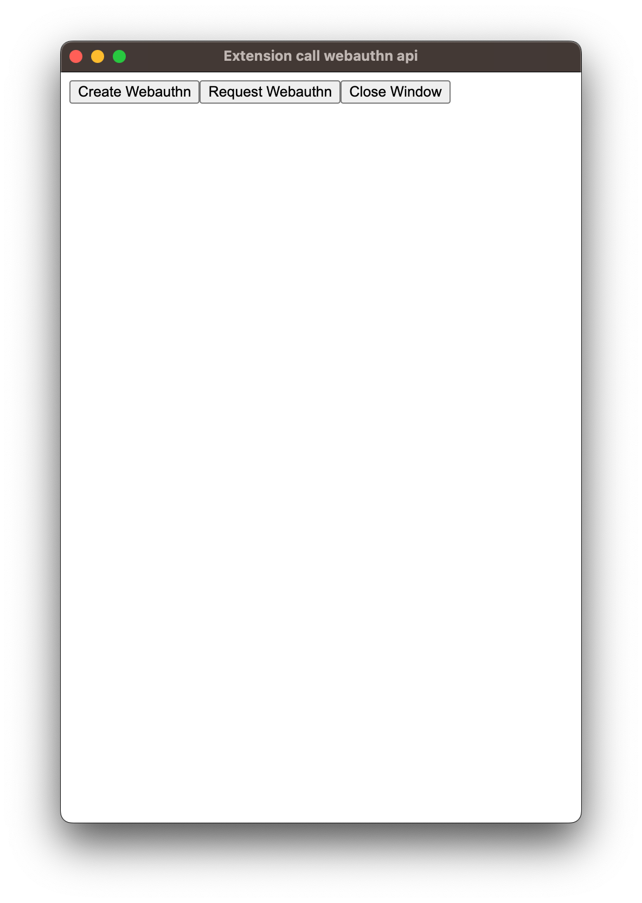

This is a [Plasmo extension](https://docs.plasmo.com/) project bootstrapped with [`plasmo init`](https://www.npmjs.com/package/plasmo).

## Getting Started

First, run the development server:

```bash
pnpm dev
# or
npm run dev
```

Open your browser and load the appropriate development build. For example, if you are developing for the chrome browser, using manifest v3, use: `build/chrome-mv3-dev`.

## Create/Request Webauthn

- Open popup and click the `Open Webauthn window` button



- Create Webauthn by clicking `Create Webauthn` button or request Webauthn by clicking `Request Webauthn` button


